# Panorama-FASTR-Stitch — Feature-Based Panorama Stitching (MATLAB)

**FASTR-Stitch** is a compact, modular panorama pipeline that re-implements classic CV end-to-end:
**FAST/FASTR** corners → **SURF** descriptors → **Lowe ratio + mutual match** → **RANSAC homography** → **warp + blend**.

> **FASTR = FAST + Harris filtering** for more selective, match-friendly corners.

---

## Highlights
- Custom **FAST/FASTR** detector (vectorized) with Harris pruning
- **SURF** descriptors; **ratio test** + **mutual check** for clean correspondences
- **RANSAC** homography with inlier stats / reprojection error
- Linear feather blending (hooks for multiband)
- Optional detector & match visualizations saved to `output/`

---

## Quickstart

**Setup your images:**
- Place your images in the `demo_images/` folder  
- Or modify the paths at the top of `main.m`


```matlab

% In MATLAB, navigate to the project folder
main

```
That's it! Just press play on `main.m`

**Requirements:** MATLAB R2018b+, Computer Vision Toolbox, Image Processing Toolbox.

---


## Results (inputs → panorama)

### Set 1 (2 images)

<p align="center">
  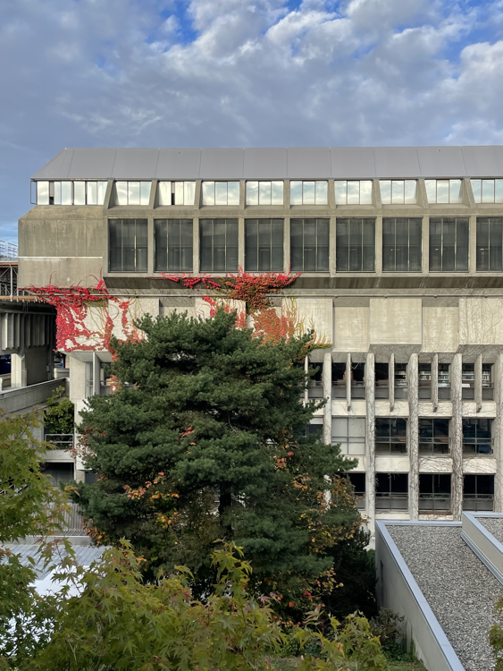
  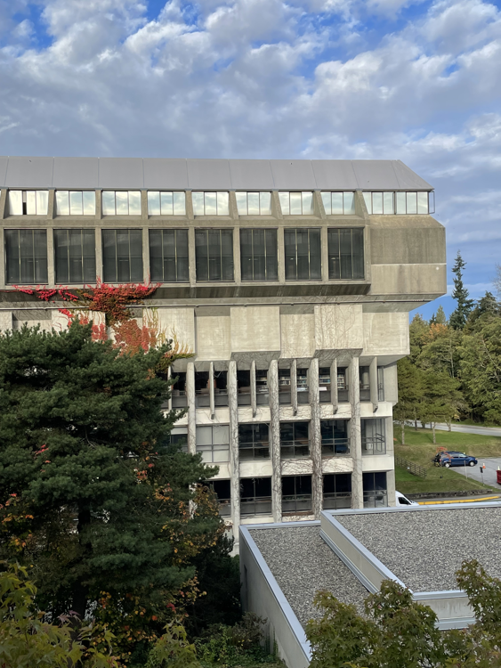
  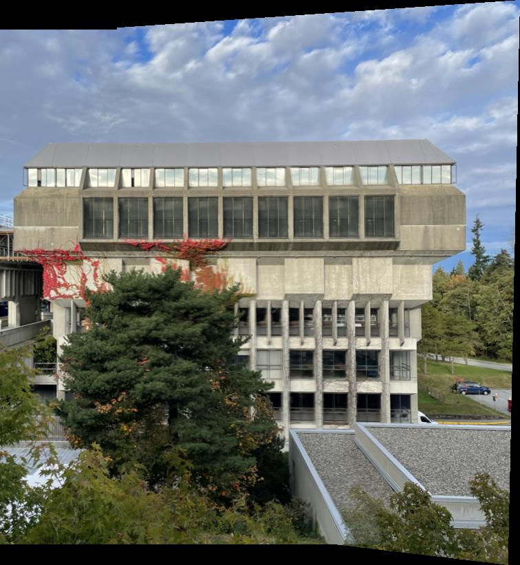
</p>

<details>
<summary>Feature matches (saved by the pipeline)</summary>

* FAST matches: `output/set1_fast_matches.png`  
* FASTR matches: `output/set1_fastr_matches.png`

</details>

---

### Set 2 (4 images)

<p align="center">
  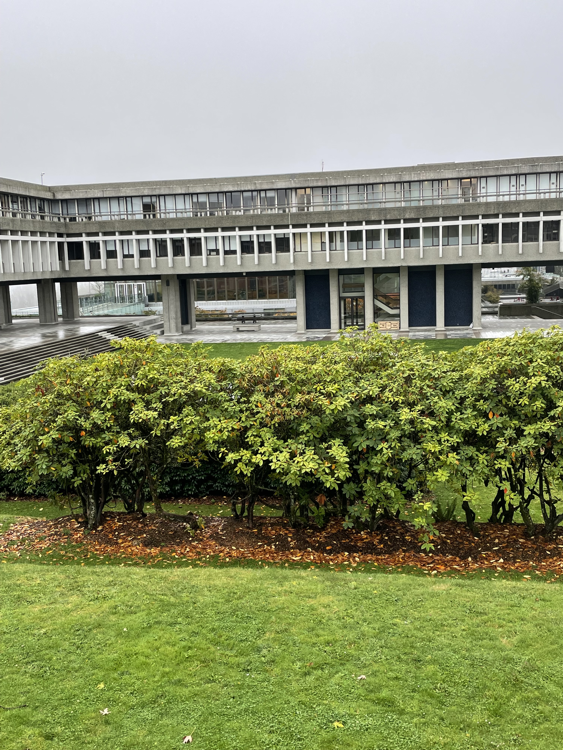
  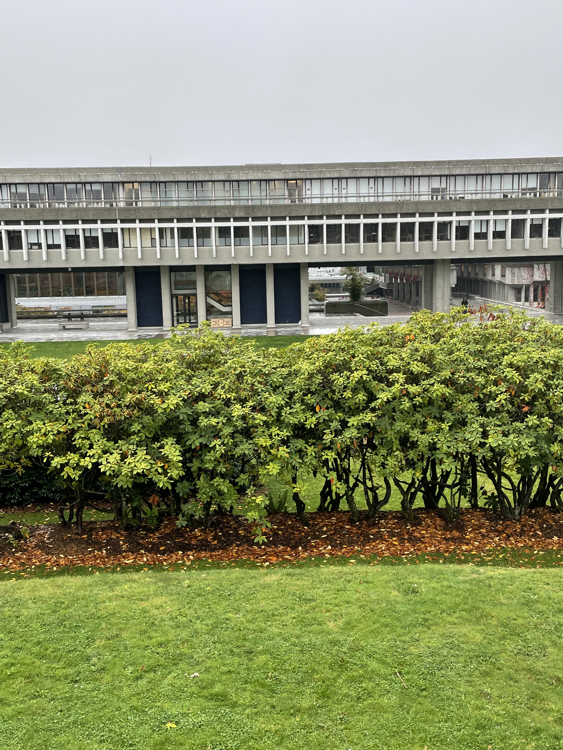
  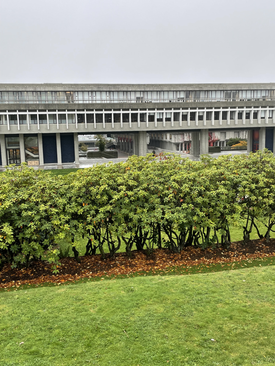
  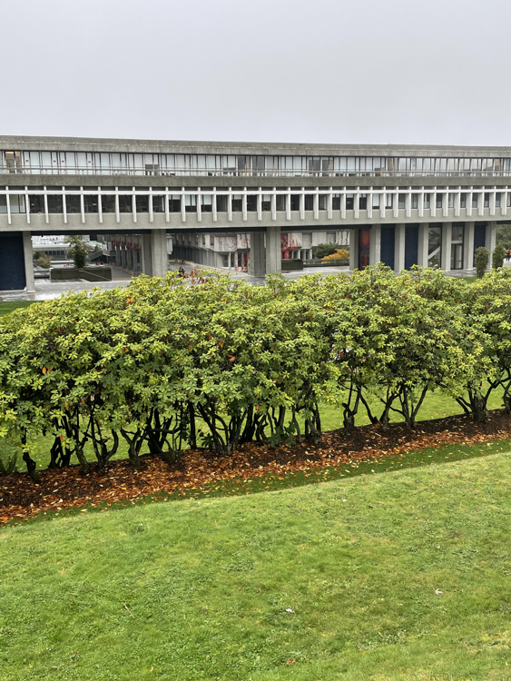
</p>
<p align="center">
  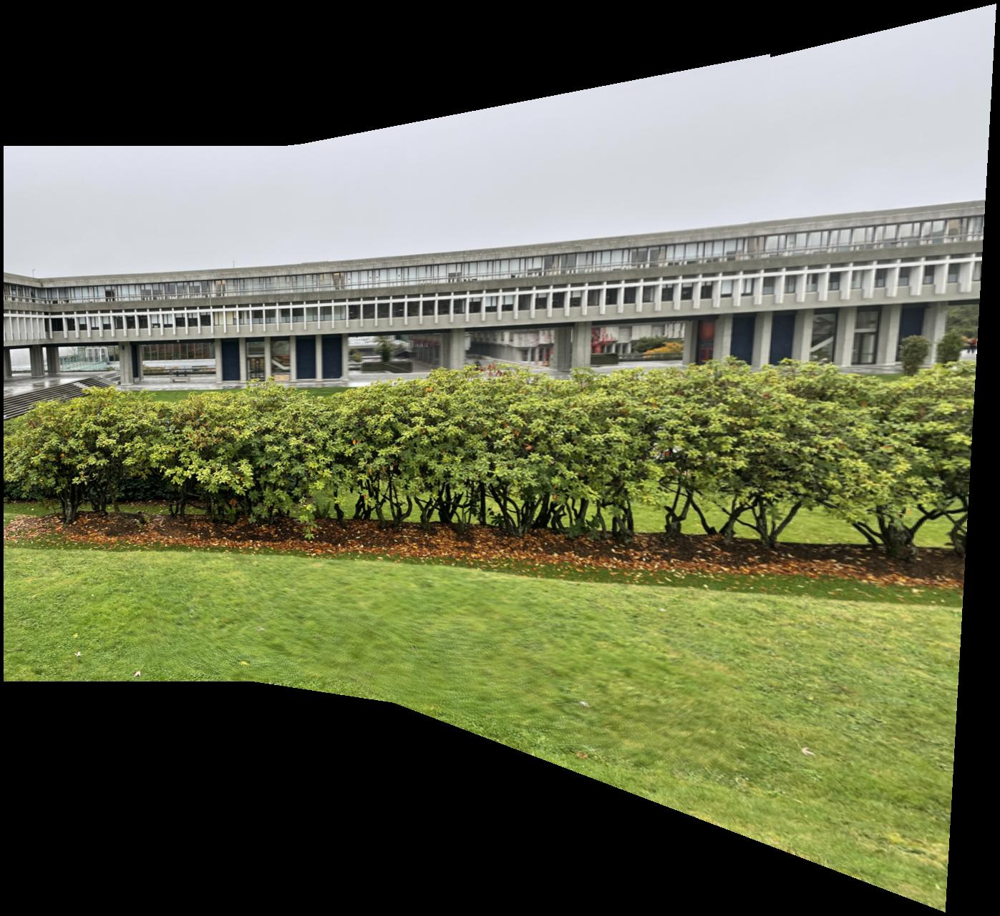
</p>

---

### Set 3 (4 images)

<p align="center">
  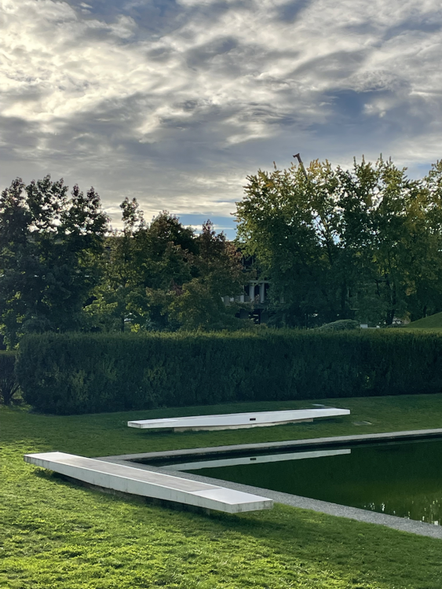
  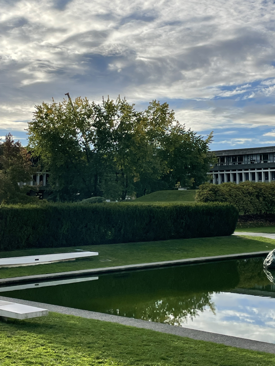
  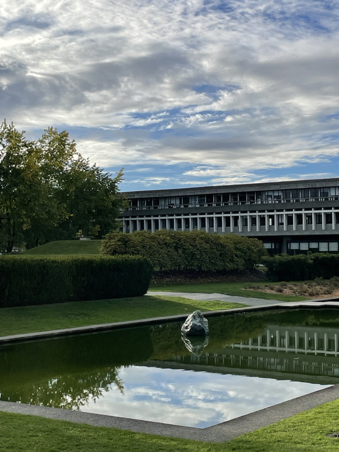
  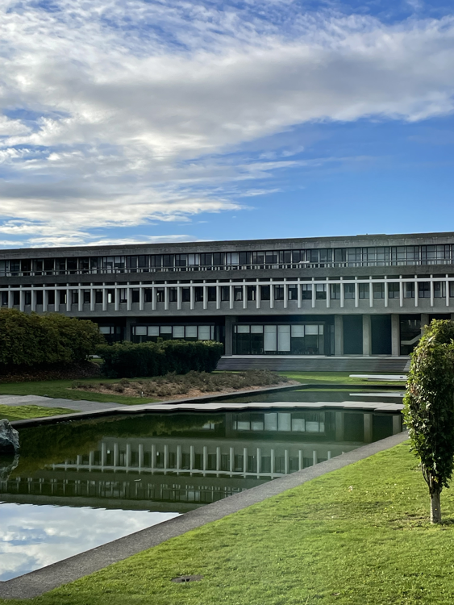
</p>
<p align="center">
  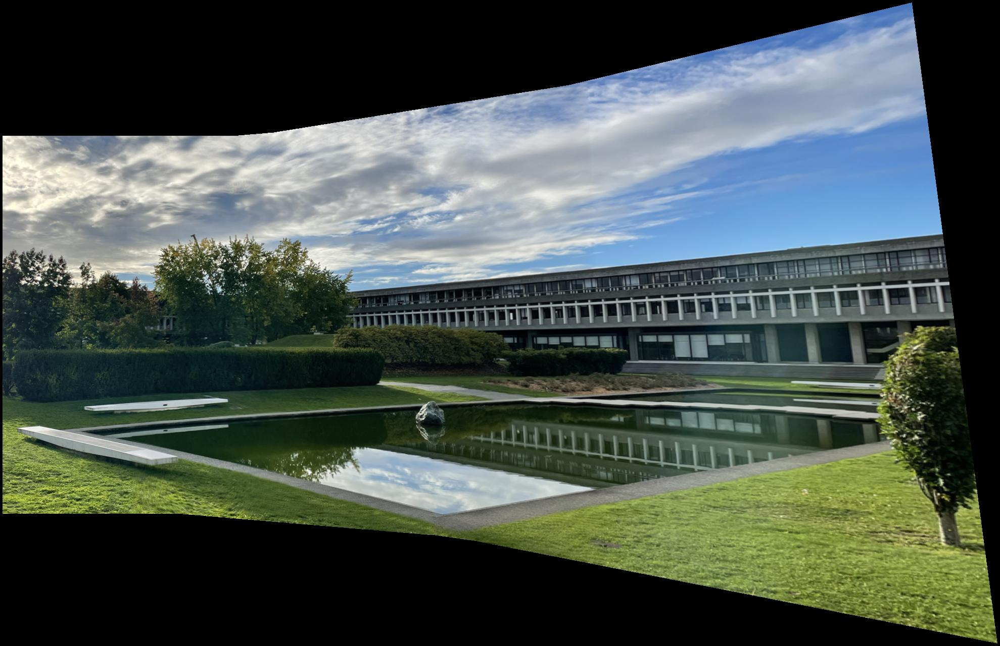
</p>

---

## How it works

1. **Detect:** FAST finds candidate corners; **Harris** filters edge-like/weak points (FASTR).
2. **Describe:** **SURF** builds rotation-robust 64-D descriptors.
3. **Match:** **Lowe’s ratio** + **mutual (symmetric) check** prune ambiguities.
4. **Estimate H:** **RANSAC** fits a homography; reports inliers & error.
5. **Warp + Blend:** images are warped into a common frame and blended (**linear feathering**; multiband available).

Run statistics are written to `output/processing_summary.txt`.

---

## Project layout

```
Pano_Stitcher/
├── main.m                      # Entry point and configuration
├── PanoramaStitcher.m          # Main pipeline orchestrator
├── FastDetector.m              # Custom FAST implementation
├── FeatureMatcher.m            # Matching and RANSAC
├── ImageBlender.m              # Warping and blending
├── utils/
│   ├── loadAndPrepImages.m    # Image loading and preprocessing
│   └── saveResults.m          # Output handling
├── demo_images/               # Test images from the campus
└── output/                    # Generated panos
```

---

## Roadmap

* Cylindrical / spherical projection for wider FOV
* Exposure / gain compensation in overlaps
* Bundle adjustment for multi-image global consistency
* Multiband (Laplacian pyramid) blending as default

---

