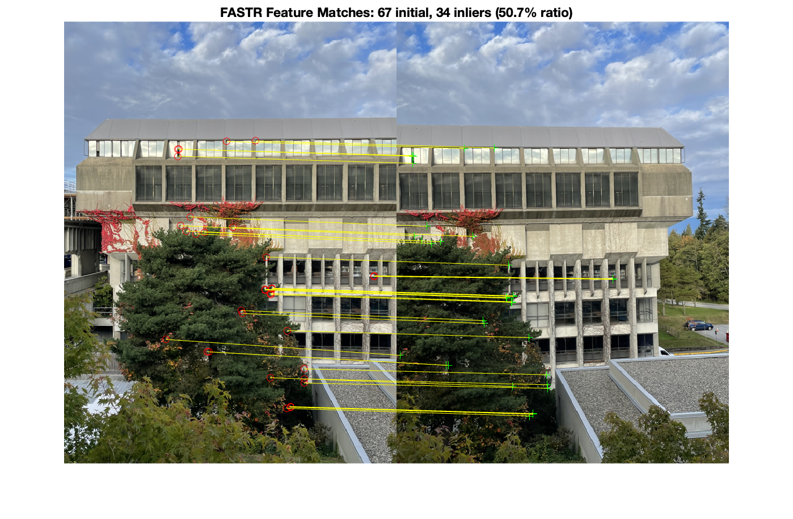

# Panorama-FASTR-Stitch — Custom FAST Detection + SURF Matching

A complete panorama pipeline implementing **FAST corner detection** from scratch with **SURF descriptors** and **RANSAC homography estimation**.

## Features
- **Custom FAST detector** with optional Harris filtering (FASTR variant)
- **SURF descriptors** for rotation-invariant matching
- **RANSAC** for robust homography estimation
- **Linear feathering** for seamless blending
- Handles 2-20 images automatically

## Quick Start

```matlab
% Just run main.m in MATLAB
main
```

**Requirements:** MATLAB R2018b+ (I used MATLAB R2024b), Computer Vision Toolbox, Image Processing Toolbox


## Results (inputs → panorama)

### Set 1: WAC Bennett Library (2 images → panorama)


<p align="center">
  
  
</p>
<p align="center">
  
</p>

---

### Set 2: Academic Building (4 images → panorama)

<p align="center">
  
  
  
  
</p>
<p align="center">
  
</p>

---

### Set 3: Reflection Pond (4 images → panorama)

<p align="center">
  
  
  
  
</p>
<p align="center">
  
</p>

---

*Test images captured around Simon Fraser University, Burnaby campus*

## How It Works

1. **FAST Detection**: Examines 16-pixel circle around each point, requires 12 contiguous bright/dark pixels
2. **Harris Filtering**: Removes unstable edge features (FASTR = FAST + Robust)
3. **SURF Matching**: 64-dimensional descriptors with Lowe's ratio test (0.75 threshold)
4. **RANSAC**: Estimates homography from noisy matches (99.9% confidence, 500 iterations)
5. **Blend**: Linear distance-weighted feathering in overlap regions

## Performance

| Image Set | Images | Features/Image | Matches | Inliers | Time |
|-----------|--------|----------------|---------|---------|------|
| Set 1 | 2 | ~500 | 67 | 50.7% | 0.96s |
| Set 2 | 4 | ~500 | 89 | 60.7% | 1.84s |
| Set 3 | 4 | ~500 | 91 | 48.2% | 1.96s |

## Project Structure

```
Panorama-FastR-Stitch/
├── main.m                      # Entry point - run this
├── PanoramaStitcher.m          # Main pipeline 
├── FastDetector.m              # Custom FAST implementation
├── FeatureMatcher.m            # SURF matching and RANSAC
├── ImageBlender.m              # Warping and blending
├── utils/
│   ├── loadAndPrepImages.m    # Image loading and preprocessing
│   └── saveResults.m          # Output handling
├── demo_images/               # Test images from the campus
└── output/                    # Generated panos
```

## Key Implementation Details

**FAST Parameters:**
- Intensity threshold: 0.15 (15% brightness difference)
- Contiguous pixels: N=12 (75% of circle)
- Harris threshold: 0.005 for filtering

**RANSAC Configuration:**
- Max trials: 500
- Confidence: 99.9%
- Inlier threshold: 3 pixels reprojection error

## Feature Matching Visualization

The pipeline generates match visualizations showing FAST vs FASTR performance:

<p align="center">
  
  <br>
  <em>FASTR matches with inlier detection (green lines = good matches)</em>
</p>

## Future Improvements

- [ ] Cylindrical projection for wider FOV
- [ ] Bundle adjustment for global optimization  
- [ ] Exposure compensation
- [ ] GPU acceleration

---

**Author:** Raman Kumar  

*Run `main.m` to process images in `demo_images/` folder. Results saved to `output/`*
*All stitched panoramas and visualizations are in `output/`. Run `main.m` to regenerate.*

